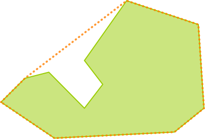
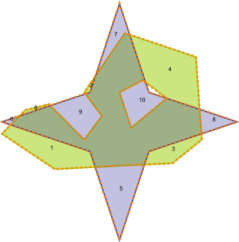
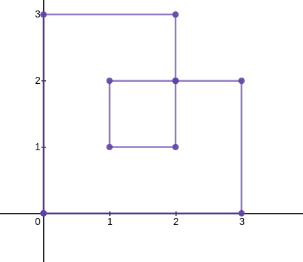
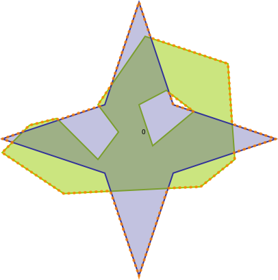
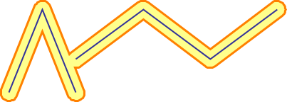

[boost documentation](https://www.boost.org/doc/libs/1_76_0/libs/geometry/doc/html/index.html)

##### [convex_hull](https://www.boost.org/doc/libs/1_76_0/libs/geometry/doc/html/geometry/reference/algorithms/convex_hull/convex_hull_2.html)：用一个最小凸多边形将原形状包住

```cpp
template<typename Geometry, typename OutputGeometry>
void convex_hull(Geometry const & geometry, OutputGeometry & hull)
```



correct：将poly的点封闭，并且点的顺序更正

```cpp
template<typename Geometry>
void correct(Geometry & geometry)
```

covered_by:检查geometry1是否被geometry2包含，是则返回true

```cpp
template<typename Geometry1, typename Geometry2>
bool covered_by(Geometry1 const & geometry1, Geometry2 const & geometry2)
```

crosses:两个geometry是否相交

```cpp
template<typename Geometry1, typename Geometry2>
bool crosses(Geometry1 const & geometry1, Geometry2 const & geometry2)
```

densify：将原geometry变稠密，稠密程度由max_distance来确定，输出到out里面

```cpp
template<typename Geometry, typename Distance>
void densify(Geometry const & geometry, Geometry & out, Distance const & max_distance)
```

difference:geometry1比geometry2多出的区域，保存再vector或者deque里面

```cpp
template<typename Geometry1, typename Geometry2, typename Collection>
void difference(Geometry1 const & geometry1, Geometry2 const & geometry2, Collection & output_collection)
```

[discrete_frechet_distance](https://www.boost.org/doc/libs/1_76_0/libs/geometry/doc/html/geometry/reference/algorithms/discrete_frechet_distance/discrete_frechet_distance_2.html):两条曲线的相似度计算，通常计算 LineString-LineString

```cpp
template<typename Geometry1, typename Geometry2>
distance_result< typename point_type<Geometry1>::type, typename point_type<Geometry2>::type >::type discrete_frechet_distance(Geometry1 const & geometry1, Geometry2 const & geometry2)
```

##### [discrete_hausdorff_distance](https://www.boost.org/doc/libs/1_76_0/libs/geometry/doc/html/geometry/reference/algorithms/discrete_hausdorff_distance/discrete_hausdorff_distance_2.html)：Hausdorff距离是描述两组点集之间相似程度的一种量度，它是两个点集之间距离的一种定义形式。[计算方法](https://blog.csdn.net/hupengfei_shenyang/article/details/94741834 )

就是将A中每个点分别计算到B中所有点的距离，取最短的。然后A中点得到的距离取最大的一个）

```cpp
template<typename Geometry1, typename Geometry2>
distance_result< typename point_type<Geometry1>::type, typename point_type<Geometry2>::type >::type discrete_hausdorff_distance(Geometry1 const & geometry1, Geometry2 const & geometry2)
```

H (A, B) = max { h (A, B), h (B, A) }


##### [disjoint](https://www.boost.org/doc/libs/1_76_0/libs/geometry/doc/html/geometry/reference/algorithms/disjoint/disjoint_2.html)：两个geometry是否不相交，不相交返回true

```
template<typename Geometry1, typename Geometry2>
bool disjoint(Geometry1 const & geometry1, Geometry2 const & geometry2)
```

##### [distance](https://www.boost.org/doc/libs/1_76_0/libs/geometry/doc/html/geometry/reference/algorithms/distance/distance_2.html)：计算两个geometry的距离，所有的geometry类型之间都可以计算距离

```
boost::geometry::distance(p, poly)
```

##### [comparable_distance](https://www.boost.org/doc/libs/1_76_0/libs/geometry/doc/html/geometry/reference/algorithms/distance/comparable_distance_2.html)：计算相对的距离，所以同种之间结果还是可以比大小的

```cpp
boost::geometry::comparable_distance(p, pv)
```

##### [envelope](https://www.boost.org/doc/libs/1_76_0/libs/geometry/doc/html/geometry/reference/algorithms/envelope/envelope_2.html)：计算geometry的最小外包矩形（矩形的轴是垂直于xy轴的）

```cpp
template<typename Geometry, typename Box>
void envelope(Geometry const & geometry, Box & mbr)
```

##### [return_envelope](https://www.boost.org/doc/libs/1_76_0/libs/geometry/doc/html/geometry/reference/algorithms/envelope/return_envelope_1.html)：上一个是引用，这一个是返回

```cpp
template<typename Box, typename Geometry>
Box return_envelope(Geometry const & geometry)
```

##### [equals](https://www.boost.org/doc/libs/1_76_0/libs/geometry/doc/html/geometry/reference/algorithms/equals/equals_2.html)：检查两个geometry是否spatially  equal

```cpp
template<typename Geometry1, typename Geometry2>
bool equals(Geometry1 const & geometry1, Geometry2 const & geometry2)
```

##### [expand](https://www.boost.org/doc/libs/1_76_0/libs/geometry/doc/html/geometry/reference/algorithms/expand/expand_2.html)：Expands a box using the bounding box (envelope) of another geometry (box, point)

```
template<typename Box, typename Geometry>
void expand(Box & box, Geometry const & geometry)
```

##### [for_each_point](https://www.boost.org/doc/libs/1_76_0/libs/geometry/doc/html/geometry/reference/algorithms/for_each/for_each_point.html)：Applies a function **f** (functor, having operator() defined) to each point making up the geometry

```
template<typename Geometry, typename Functor>
Functor for_each_point(Geometry & geometry, Functor f)
```

##### [intersection](https://www.boost.org/doc/libs/1_76_0/libs/geometry/doc/html/geometry/reference/algorithms/intersection/intersection_3.html)：计算两个geometry的交集，保存在vector或deque里面

```cpp
    typedef boost::geometry::model::polygon<boost::geometry::model::d2::point_xy<double> > polygon;

    polygon green, blue;

    boost::geometry::read_wkt(
        "POLYGON((2 1.3,2.4 1.7,2.8 1.8,3.4 1.2,3.7 1.6,3.4 2,4.1 3,5.3 2.6,5.4 1.2,4.9 0.8,2.9 0.7,2 1.3)"
            "(4.0 2.0, 4.2 1.4, 4.8 1.9, 4.4 2.2, 4.0 2.0))", green);

    boost::geometry::read_wkt(
        "POLYGON((4.0 -0.5 , 3.5 1.0 , 2.0 1.5 , 3.5 2.0 , 4.0 3.5 , 4.5 2.0 , 6.0 1.5 , 4.5 1.0 , 4.0 -0.5))", blue);

    std::deque<polygon> output;
    boost::geometry::intersection(green, blue, output);
    int i = 0;
    std::cout << "green && blue:" << std::endl;
    BOOST_FOREACH(polygon const& p, output)
    {
        std::cout << i++ << ": " << boost::geometry::area(p) << std::endl;
    }

```

##### [intersects (one geometry)](https://www.boost.org/doc/libs/1_76_0/libs/geometry/doc/html/geometry/reference/algorithms/intersects/intersects_1_one_geometry.html)：自己是否和自己相交

##### [intersects (two geometries)](https://www.boost.org/doc/libs/1_76_0/libs/geometry/doc/html/geometry/reference/algorithms/intersects/intersects_2_two_geometries.html)：两个geometry是否相交

#### [is_empty](https://www.boost.org/doc/libs/1_76_0/libs/geometry/doc/html/geometry/reference/algorithms/is_empty.html)：geometry是否为空

```
template<typename Geometry>
bool is_empty(Geometry const & geometry)
```

##### [is_simple](https://www.boost.org/doc/libs/1_76_0/libs/geometry/doc/html/geometry/reference/algorithms/is_simple/is_simple_1.html)：geometry是否simple

##### [is_valid](https://www.boost.org/doc/libs/1_76_0/libs/geometry/doc/html/geometry/reference/algorithms/is_valid/is_valid_1.html)：geometry是否valid（In the OGC sense）

```
the following geometries are considered valid: multi-geometries with no elements, linear geometries containing spikes, areal geometries with duplicate (consecutive) points
```

##### [length](https://www.boost.org/doc/libs/1_76_0/libs/geometry/doc/html/geometry/reference/algorithms/length/length_1.html):计算geometry的length，只有linear（eg. linestrip）才会返回相邻点的距离和，其他pointlike（eg. point）和areal(eg. polygon)都返回0

##### [line_interpolate](https://www.boost.org/doc/libs/1_76_0/libs/geometry/doc/html/geometry/reference/algorithms/line_interpolate/line_interpolate_3.html):返回LinsString（或者任何含有LineString的数据结构）中一个多个点的插值结果

```cpp
template<typename Geometry, typename Distance, typename Pointlike>
void line_interpolate(Geometry const & geometry, Distance const & max_distance, Pointlike & pointlike)
//max_distance
```

```cpp
     using linestring_type = model::linestring<point_type>;
    using multipoint_type = model::multi_point<point_type>;

    segment_type const s { {0, 0}, {1, 1} };
    linestring_type const l { {0, 0}, {1, 0}, {1, 1}, {0, 1}, {0, 2} };
    point_type p;
    multipoint_type mp=multipoint_type();
    line_interpolate(l, 1.4, mp);//对于l中从起点开始，沿着l的点的路径，每隔1.4取一个点，存到mp中。（不包含起点和终点）
```

[make](https://www.boost.org/doc/libs/1_76_0/libs/geometry/doc/html/geometry/reference/algorithms/make.html)

#### [num_geometries](https://www.boost.org/doc/libs/1_76_0/libs/geometry/doc/html/geometry/reference/algorithms/num_geometries.html)：计算一个geometry中的geometries数量

```
template<typename Geometry>
std::size_t num_geometries(Geometry const & geometry)
```

| Case                                       | Behavior                                                     |
| ------------------------------------------ | ------------------------------------------------------------ |
| single (e.g. point, polygon)               | Returns 1                                                    |
| multiple (e.g. multi_point, multi_polygon) | Returns boost::size(geometry); the input is considered as a range |

#### [num_interior_rings](https://www.boost.org/doc/libs/1_76_0/libs/geometry/doc/html/geometry/reference/algorithms/num_interior_rings.html)：计算

#### [num_points](https://www.boost.org/doc/libs/1_76_0/libs/geometry/doc/html/geometry/reference/algorithms/num_points.html)：计算点数

#### [num_segments](https://www.boost.org/doc/libs/1_76_0/libs/geometry/doc/html/geometry/reference/algorithms/num_segments.html)：

##### [overlaps](https://www.boost.org/doc/libs/1_76_0/libs/geometry/doc/html/geometry/reference/algorithms/overlaps/overlaps_2.html)：检查两个geometry是否重叠，比如两个多边形相交，如果重叠返回true

```cpp
template<typename Geometry1, typename Geometry2>
bool overlaps(Geometry1 const & geometry1, Geometry2 const & geometry2)
```

##### [perimeter](https://www.boost.org/doc/libs/1_76_0/libs/geometry/doc/html/geometry/reference/algorithms/perimeter/perimeter_1.html)：计算geometry的周长

```
double perimeter = bg::perimeter(poly);
```

| Case                     | Behavior              |
| ------------------------ | --------------------- |
| pointlike (e.g. point)   | Returns zero          |
| linear (e.g. linestring) | Returns zero          |
| areal (e.g. polygon)     | Returns the perimeter |

##### [relate](https://www.boost.org/doc/libs/1_76_0/libs/geometry/doc/html/geometry/reference/algorithms/relate/relate_3.html)：Checks relation between a pair of geometries defined by a mask.

```cpp
template<typename Geometry1, typename Geometry2, typename Mask>
bool relate(Geometry1 const & geometry1, Geometry2 const & geometry2, Mask const & mask)
```

##### [relation](https://www.boost.org/doc/libs/1_76_0/libs/geometry/doc/html/geometry/reference/algorithms/relation/relation_2.html)：Calculates the relation between a pair of geometries as defined in DE-9IM.

```cpp
template<typename Geometry1, typename Geometry2>
de9im::matrix relation(Geometry1 const & geometry1, Geometry2 const & geometry2)
```

#### [reverse](https://www.boost.org/doc/libs/1_76_0/libs/geometry/doc/html/geometry/reference/algorithms/reverse.html)：Reverses the points within a geometry（LineString,Ring，或者polygon中的Ring）.

```cpp
void reverse(Geometry & geometry)
```

##### [simplify](https://www.boost.org/doc/libs/1_76_0/libs/geometry/doc/html/geometry/reference/algorithms/simplify/simplify_3.html)：简化一个geometry。有可能返回invalid，因为可能得到自交的geometry

```cpp
template<typename Geometry, typename Distance>
void simplify(Geometry const & geometry, Geometry & out, Distance const & max_distance)
```

##### 

```cpp
template<typename Geometry, typename Distance>
void simplify(Geometry const & geometry, Geometry & out, Distance const & max_distance)
```

##### [sym_difference](https://www.boost.org/doc/libs/1_76_0/libs/geometry/doc/html/geometry/reference/algorithms/sym_difference/sym_difference_3.html)：计算两个geometry的XOR结果

```cpp
template<typename Geometry1, typename Geometry2, typename Collection>
void sym_difference(Geometry1 const & geometry1, Geometry2 const & geometry2, Collection & output_collection)
```



##### [touches (one geometry)](https://www.boost.org/doc/libs/1_76_0/libs/geometry/doc/html/geometry/reference/algorithms/touches/touches_1_one_geometry.html)：Checks if a geometry has at least one touching point (self-tangency)，自己有交点



##### [touches (two geometries)](https://www.boost.org/doc/libs/1_76_0/libs/geometry/doc/html/geometry/reference/algorithms/touches/touches_2_two_geometries.html)：两个geometry是否有交点（touching point），必须是相同的点

```cpp
template<typename Geometry1, typename Geometry2>
bool touches(Geometry1 const & geometry1, Geometry2 const & geometry2)
```

##### [transform](https://www.boost.org/doc/libs/1_76_0/libs/geometry/doc/html/geometry/reference/algorithms/transform/transform_2.html):Transforms from one geometry to another geometry using a strategy.transform成功则返回true

##### [transform (with strategy)](https://www.boost.org/doc/libs/1_76_0/libs/geometry/doc/html/geometry/reference/algorithms/transform/transform_3_with_strategy.html)：用各种策略转换，旋转、缩放、平移，可以trans::translate_transformer，trans::scale_transformer，trans::rotate_transformer（顺时针为正）

```cpp
template<typename Geometry1, typename Geometry2>
bool transform(Geometry1 const & geometry1, Geometry2 & geometry2)
```

[union_](https://www.boost.org/doc/libs/1_76_0/libs/geometry/doc/html/geometry/reference/algorithms/union_/union__3.html)：Combines two geometries which each other.并集

```cpp
template<typename Geometry1, typename Geometry2, typename Collection>
void union_(Geometry1 const & geometry1, Geometry2 const & geometry2, Collection & output_collection)
```



#### [unique](https://www.boost.org/doc/libs/1_76_0/libs/geometry/doc/html/geometry/reference/algorithms/unique.html)：Calculates the minimal set of a geometry.（连续的相同点会被移除）

```cpp
template<typename Geometry>
void unique(Geometry & geometry)
```

##### [within](https://www.boost.org/doc/libs/1_76_0/libs/geometry/doc/html/geometry/reference/algorithms/within/within_2.html)：检查geometry1是否再geometry2中

```cpp
template<typename Geometry1, typename Geometry2>
bool within(Geometry1 const & geometry1, Geometry2 const & geometry2)
```


example：

1.[根据车辆轨迹，向两边偏移半个车道宽，生成车道线](https://www.boost.org/doc/libs/1_76_0/libs/geometry/doc/html/geometry/reference/strategies/strategy_buffer_distance_symmetric.html)

这里直接生成一个polygon，正好后面可以拿来求并集

```cpp
#include <boost/geometry.hpp>
#include <boost/geometry/geometries/point_xy.hpp>
#include <boost/geometry/geometries/geometries.hpp>

int main()
{
    typedef boost::geometry::model::d2::point_xy<double> point;
    typedef boost::geometry::model::linestring<point> linestring;
    typedef boost::geometry::model::polygon<point> polygon;

    // Declare the symmetric distance strategy
    boost::geometry::strategy::buffer::distance_symmetric<double> distance_strategy(0.5);

    // Declare other strategies
    boost::geometry::strategy::buffer::side_straight side_strategy;
    boost::geometry::strategy::buffer::join_round join_strategy;
    boost::geometry::strategy::buffer::end_round end_strategy;
    boost::geometry::strategy::buffer::point_circle point_strategy;

    // Declare/fill a multi linestring
    boost::geometry::model::multi_linestring<linestring> ml;
    boost::geometry::read_wkt("MULTILINESTRING((3 5,5 10,7 5),(7 7,11 10,15 7,19 10))", ml);

    // Create the buffered geometry with left/right the same distance
    boost::geometry::model::multi_polygon<polygon> result;
    boost::geometry::buffer(ml, result,
                distance_strategy, side_strategy,
                join_strategy, end_strategy, point_strategy);


    return 0;
}
```



